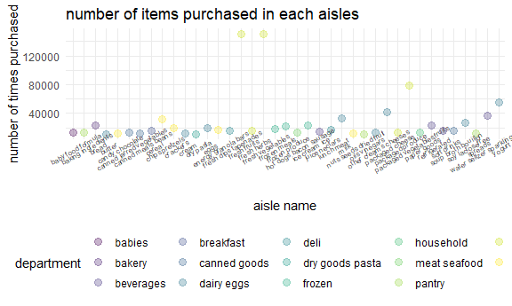
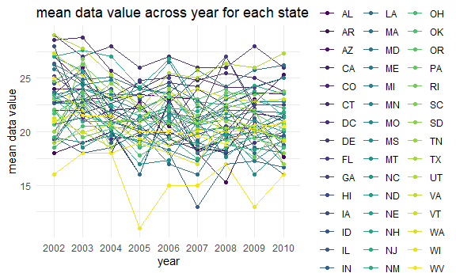
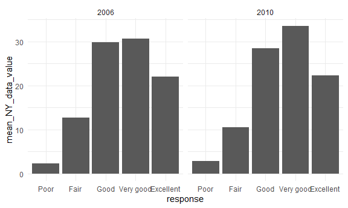
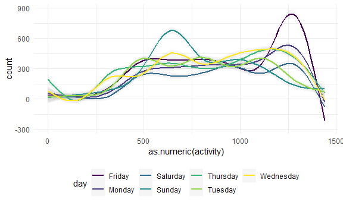

p8105\_hw3\_xl3141
================
Xinyuan Liu
10/15/2021

## Set options

``` r
library(tidyverse)
```

    ## -- Attaching packages --------------------------------------- tidyverse 1.3.1 --

    ## v ggplot2 3.3.5     v purrr   0.3.4
    ## v tibble  3.1.4     v dplyr   1.0.7
    ## v tidyr   1.1.3     v stringr 1.4.0
    ## v readr   2.0.1     v forcats 0.5.1

    ## -- Conflicts ------------------------------------------ tidyverse_conflicts() --
    ## x dplyr::filter() masks stats::filter()
    ## x dplyr::lag()    masks stats::lag()

``` r
library(p8105.datasets)
library(httr)
library(jsonlite)
```

    ## 
    ## Attaching package: 'jsonlite'

    ## The following object is masked from 'package:purrr':
    ## 
    ##     flatten

``` r
library(lubridate)
```

    ## 
    ## Attaching package: 'lubridate'

    ## The following objects are masked from 'package:base':
    ## 
    ##     date, intersect, setdiff, union

``` r
knitr::opts_chunk$set(
  fig.width = 6,
  fig.asp = .6,
  out.width = "90%"
)

theme_set(theme_minimal() + theme(legend.position = "bottom"))

options(
  ggplot2.continuous.colour = "viridis",
  ggplot2.continuous.fill = "viridis"
)

scale_colour_discrete = scale_colour_viridis_d
scale_fill_discrete = scale_fill_viridis_d
```

## Problem 1

``` r
data("instacart")
ncol(instacart)
```

    ## [1] 15

``` r
nrow(instacart)
```

    ## [1] 1384617

``` r
instacart %>% 
  group_by(product_name) %>% 
  summarise(n_obs = n()) %>% 
  filter(n_obs == max(n_obs)) ##choose the most popular product
```

    ## # A tibble: 1 x 2
    ##   product_name n_obs
    ##   <chr>        <int>
    ## 1 Banana       18726

``` r
day_prior = instacart %>% 
  group_by(user_id) %>% 
  select(user_id, days_since_prior_order) %>% 
  unique() ##get the days since prior order for each unique user

mean(pull(day_prior, days_since_prior_order))
```

    ## [1] 17.04986

The data has 15 columns and 1384617 rows in total. The variables of
interest are *days since prior order*, *product name*, and *reordered*.
The product that is mostly bought is banana which is bought 18726 times
in total. The average days since prior order is 17 days.

``` r
instacart %>% 
  group_by(aisle) %>% 
  summarise(n_obs = n()) %>% ##count the number of aisles
  mutate(rank = rank(desc(n_obs))) %>% 
  filter(rank < 2) ##rank the numbers and find the largest one
```

    ## # A tibble: 1 x 3
    ##   aisle             n_obs  rank
    ##   <chr>             <int> <dbl>
    ## 1 fresh vegetables 150609     1

We have 134 aisles and most items are ordered from aisle “fresh
vegetables”.

``` r
instacart %>% 
  group_by(aisle, department) %>% 
  summarize(n_obs = n()) %>% 
  filter(n_obs > 10000) %>% ##get aisles with number > 10000
  relocate(department) %>% 
  ggplot(aes(x = aisle, y = n_obs, color = department)) +
  geom_point(alpha = .3, size = 3) +
  labs(
    title = "number of items purchased in each aisles",
    x = "aisle name",
    y = "number of times purchased"
  ) +
  theme(axis.text.x = element_text(size = 6, angle = 30))
```

    ## `summarise()` has grouped output by 'aisle'. You can override using the `.groups` argument.



``` r
instacart %>% 
  group_by(aisle, product_name) %>% 
  filter(aisle == "baking ingredients") %>% ##look for baking ingredients in aisle column
  summarize(n_obs = n()) %>% 
  mutate(rank = rank(desc(n_obs))) %>% ##rank based on popularity
  filter(rank < 4) %>% 
  knitr::kable()
```

    ## `summarise()` has grouped output by 'aisle'. You can override using the `.groups` argument.

| aisle              | product\_name     | n\_obs | rank |
|:-------------------|:------------------|-------:|-----:|
| baking ingredients | Cane Sugar        |    336 |    3 |
| baking ingredients | Light Brown Sugar |    499 |    1 |
| baking ingredients | Pure Baking Soda  |    387 |    2 |

``` r
instacart %>% 
  group_by(aisle, product_name) %>% 
  filter(aisle == "dog food care") %>% 
  summarize(n_obs = n()) %>% 
  mutate(rank = rank(desc(n_obs))) %>% 
  filter(rank < 4) %>% 
  knitr::kable()
```

    ## `summarise()` has grouped output by 'aisle'. You can override using the `.groups` argument.

| aisle         | product\_name                                 | n\_obs | rank |
|:--------------|:----------------------------------------------|-------:|-----:|
| dog food care | Organix Chicken & Brown Rice Recipe           |     28 |    2 |
| dog food care | Small Dog Biscuits                            |     26 |    3 |
| dog food care | Snack Sticks Chicken & Rice Recipe Dog Treats |     30 |    1 |

``` r
instacart %>% 
  group_by(aisle, product_name) %>% 
  filter(aisle == "packaged vegetables fruits") %>% 
  summarize(n_obs = n()) %>% 
  mutate(rank = rank(desc(n_obs))) %>% 
  filter(rank < 4) %>%
  knitr::kable()
```

    ## `summarise()` has grouped output by 'aisle'. You can override using the `.groups` argument.

| aisle                      | product\_name        | n\_obs | rank |
|:---------------------------|:---------------------|-------:|-----:|
| packaged vegetables fruits | Organic Baby Spinach |   9784 |    1 |
| packaged vegetables fruits | Organic Blueberries  |   4966 |    3 |
| packaged vegetables fruits | Organic Raspberries  |   5546 |    2 |

``` r
instacart %>% 
  group_by(product_name) %>% 
  mutate(
    order_dow = order_dow + 1,
    order_dow = wday(order_dow, label = TRUE)) %>% ##make number data into word
  select(order_dow, order_hour_of_day) %>% 
  filter(product_name %in% c("Pink Lady Apples", "Coffee Ice Cream")) %>%
  group_by(product_name, order_dow) %>% 
  summarize(mean = mean(order_hour_of_day)) %>% ##calculate the mean hour of the day based on group "product name" and "order dow"
  pivot_wider(
    names_from = "order_dow",
    values_from = "mean"
    ) %>% 
  knitr::kable() ## make it into a 2*7 table
```

    ## Adding missing grouping variables: `product_name`

    ## `summarise()` has grouped output by 'product_name'. You can override using the `.groups` argument.

| product\_name    |      Sun |      Mon |      Tue |      Wed |      Thu |      Fri |      Sat |
|:-----------------|---------:|---------:|---------:|---------:|---------:|---------:|---------:|
| Coffee Ice Cream | 13.77419 | 14.31579 | 15.38095 | 15.31818 | 15.21739 | 12.26316 | 13.83333 |
| Pink Lady Apples | 13.44118 | 11.36000 | 11.70213 | 14.25000 | 11.55172 | 12.78431 | 11.93750 |

## Problem 2

``` r
var_names = 
  GET("https://chronicdata.cdc.gov/views/acme-vg9e.json") %>%
  content("text") %>%
  fromJSON() %>% 
  .[["columns"]] %>% 
  .[["name"]] %>% 
  .[1:22]

brfss_smart2010 = 
  GET("https://chronicdata.cdc.gov/views/acme-vg9e/rows.json") %>% 
  content("text") %>%
  fromJSON() %>% 
  .[["data"]]

row_as_tibble = function(row_as_list, var_names) {
  var_list = row_as_list[9:30]
  names(var_list) = var_names 
  var_list[sapply(var_list, is.null)] <- NULL
  as_tibble(var_list, validate = FALSE)
}

brfss_smart2010 = 
  brfss_smart2010 %>% 
  map(.x = ., ~row_as_tibble(.x, var_names)) %>% 
  bind_rows
```

``` r
brfss_smart2010 = 
  brfss_smart2010 %>% 
    janitor::clean_names() %>% 
    filter(topic == "Overall Health") %>% 
    mutate(response = factor(x = response, levels = c("Poor", "Fair", "Good", "Very good", "Excellent"), ordered = TRUE)) %>% ##organize responses as a factortaking levels ordered from poor to excellent 
    drop_na(response)
```

``` r
brfss_smart2010 %>% 
  filter(year == "2002") %>%
  group_by(locationabbr) %>% 
  summarize(n_obs = n()) %>% 
  filter(n_obs >= 7) %>% ## show states observed more than 7 in 2002
  knitr::kable()
```

| locationabbr | n\_obs |
|:-------------|-------:|
| AZ           |     10 |
| CO           |     20 |
| CT           |     35 |
| DE           |     15 |
| FL           |     35 |
| GA           |     15 |
| HI           |     20 |
| ID           |     10 |
| IL           |     15 |
| IN           |     10 |
| KS           |     15 |
| LA           |     15 |
| MA           |     40 |
| MD           |     30 |
| ME           |     10 |
| MI           |     20 |
| MN           |     20 |
| MO           |     10 |
| NC           |     35 |
| NE           |     15 |
| NH           |     25 |
| NJ           |     40 |
| NV           |     10 |
| NY           |     25 |
| OH           |     20 |
| OK           |     15 |
| OR           |     15 |
| PA           |     50 |
| RI           |     20 |
| SC           |     15 |
| SD           |     10 |
| TN           |     10 |
| TX           |     10 |
| UT           |     25 |
| VT           |     15 |
| WA           |     20 |

``` r
brfss_smart2010 %>% 
  filter(year == "2010") %>%
  group_by(locationabbr) %>% 
  summarize(n_obs = n()) %>% 
  filter(n_obs >= 7) %>% ## show states observed more than 7 in 2010
  knitr::kable()
```

| locationabbr | n\_obs |
|:-------------|-------:|
| AL           |     15 |
| AR           |     15 |
| AZ           |     15 |
| CA           |     60 |
| CO           |     35 |
| CT           |     25 |
| DE           |     15 |
| FL           |    205 |
| GA           |     20 |
| HI           |     20 |
| IA           |     10 |
| ID           |     30 |
| IL           |     10 |
| IN           |     15 |
| KS           |     20 |
| LA           |     25 |
| MA           |     45 |
| MD           |     60 |
| ME           |     30 |
| MI           |     20 |
| MN           |     25 |
| MO           |     15 |
| MS           |     10 |
| MT           |     15 |
| NC           |     60 |
| ND           |     15 |
| NE           |     50 |
| NH           |     25 |
| NJ           |     95 |
| NM           |     30 |
| NV           |     10 |
| NY           |     45 |
| OH           |     40 |
| OK           |     15 |
| OR           |     20 |
| PA           |     35 |
| RI           |     25 |
| SC           |     35 |
| SD           |     10 |
| TN           |     25 |
| TX           |     80 |
| UT           |     30 |
| VT           |     30 |
| WA           |     50 |
| WY           |     10 |

``` r
excellent_df = 
  brfss_smart2010 %>% 
  filter(response == "Excellent") %>% ##include only excellent response
  group_by(locationabbr, year) %>% 
  summarize(mean_data_value = mean(as.integer(data_value))) ## take the mean of data value based on state and year
```

    ## `summarise()` has grouped output by 'locationabbr'. You can override using the `.groups` argument.

``` r
ggp_data_value = 
  excellent_df %>% 
  ggplot(aes(x = year, y = mean_data_value, color = locationabbr)) +
  geom_point() +
  geom_line(aes(group = locationabbr)) +
  labs(
    title = "mean data value across year for each state",
    x = "year",
    y = "mean data value"
  ) +
  theme(legend.position = "right")

ggp_data_value
```

    ## Warning: Removed 4 rows containing missing values (geom_point).

    ## Warning: Removed 3 row(s) containing missing values (geom_path).



``` r
brfss_smart2010 %>% 
  filter(locationabbr == "NY", year %in% c("2006", "2010")) %>% ## show only NY state data in 2006 and 2010
  group_by(response, year) %>% 
  summarise(mean_NY_data_value = mean(as.integer(data_value))) %>% ## take the mean data value based on response and year 
  ggplot(aes(response, mean_NY_data_value)) +
  geom_bar(stat = "identity") +
  facet_grid(. ~ year)
```

    ## `summarise()` has grouped output by 'response'. You can override using the `.groups` argument.



## Problem 3

``` r
accel_df = 
  read_csv("accel_data.csv") %>% 
  janitor::clean_names()
```

    ## Rows: 35 Columns: 1443

    ## -- Column specification --------------------------------------------------------
    ## Delimiter: ","
    ## chr    (1): day
    ## dbl (1442): week, day_id, activity.1, activity.2, activity.3, activity.4, ac...

    ## 
    ## i Use `spec()` to retrieve the full column specification for this data.
    ## i Specify the column types or set `show_col_types = FALSE` to quiet this message.

``` r
accel_df = 
  accel_df %>% 
  mutate(
    total_activity = rowSums(accel_df[, 4:1443]),
    weekday_weekend = day,
    weekday_weekend = replace(weekday_weekend, weekday_weekend %in% c("Monday", "Tuesday", "Wednesday", "Thursday", "Friday"), "Weekday"),
    weekday_weekend = replace(weekday_weekend, weekday_weekend %in% c("Saturday", "Sunday"), "Weekend")
  )
```

The dataset describes the activity count on weekdays and weekendss over
5 weeks. The important variables include *week*, *day*, *weekday vs
weekend*, and *total activity count across one day*. In total, we have
1440 activities observed everyday.

``` r
accel_df %>% 
  select(week, day, total_activity) %>% 
  pivot_wider(
    names_from = "day",
    values_from = "total_activity"
  ) %>% ## make the total activity into a wider format based on day. 
  relocate(Monday, Tuesday, Wednesday, Thursday, Friday, Saturday, Sunday) %>% 
  knitr::kable()
```

|    Monday |  Tuesday | Wednesday | Thursday |   Friday | Saturday | Sunday | week |
|----------:|---------:|----------:|---------:|---------:|---------:|-------:|-----:|
|  78828.07 | 307094.2 |    340115 | 355923.6 | 480542.6 |   376254 | 631105 |    1 |
| 295431.00 | 423245.0 |    440962 | 474048.0 | 568839.0 |   607175 | 422018 |    2 |
| 685910.00 | 381507.0 |    468869 | 371230.0 | 467420.0 |   382928 | 467052 |    3 |
| 409450.00 | 319568.0 |    434460 | 340291.0 | 154049.0 |     1440 | 260617 |    4 |
| 389080.00 | 367824.0 |    445366 | 549658.0 | 620860.0 |     1440 | 138421 |    5 |

There is a significant decrease on the total activity count on Sunday
for week 4 and 5

``` r
accel_df %>% 
  pivot_longer(
    activity_1:activity_1440,
    names_to = "activity",
    values_to = "count",
    names_prefix = "activity_"
  ) %>% ## make the activity counts into a long format
  ggplot(aes(x = as.numeric(activity), y = count, color = day)) +
  geom_smooth(alpha = .1) 
```

    ## `geom_smooth()` using method = 'gam' and formula 'y ~ s(x, bs = "cs")'



In general, the patient has higher activity count during daytime
compared to at night. The activity count spikes during the morning on
Sunday and during the night time on Friday, which suggest that the
patient usually have greater physical activity during those two time
periods.
